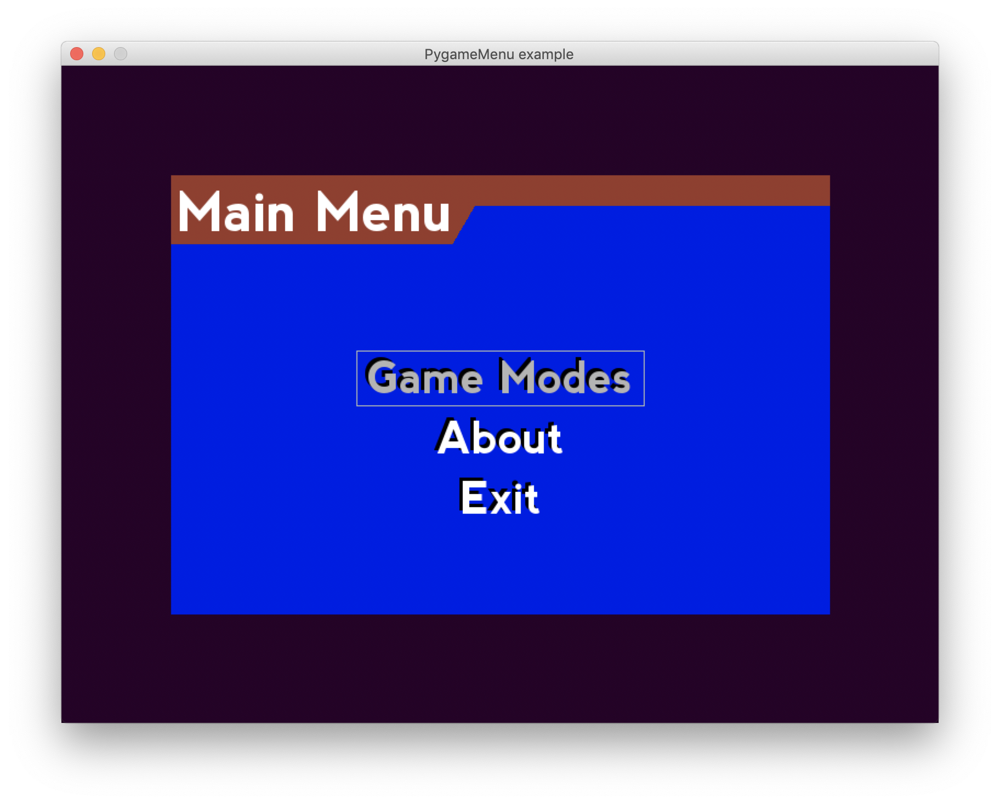
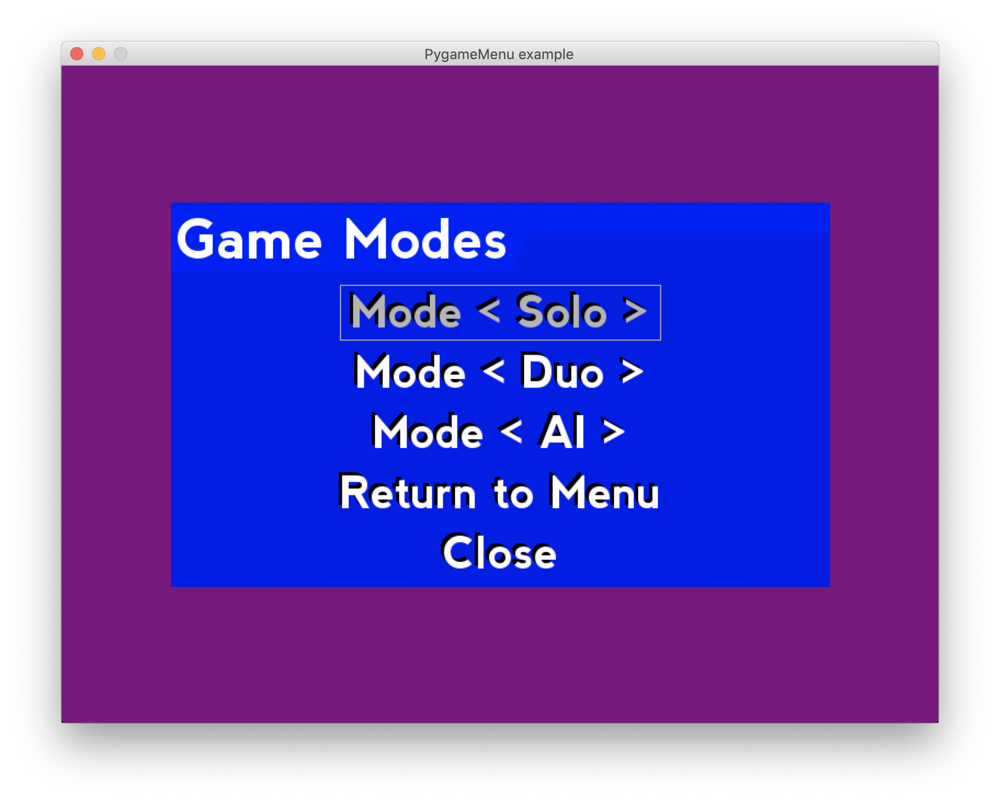
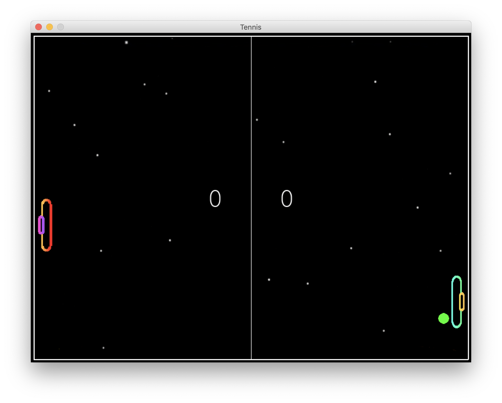

## Versions

`pygameMenu directory` : for installing pygameMenu package

`All-in-one.py`: is mac (for retina display only) version with menu

`All-in-one-win.py`: is normal windows version

`RL.py`: is a DQN training model

`pongRL.py`: is the pong game UI for `RL.py` 

`pong.py`: has better UI design but without menu

## Requirements

### Install PygameMenu

```python
import pygameMenu  # This imports classes and other things
from pygameMenu.locals import *
```

## Tips

#### Press `ESC` twice to get back to the Menu from games

## Modes

* Solo: Play against computer (left is you, right is computer)

* Duo: Two players fight with each other (left player uses W & S, right player uses up & down keys)

* AI: Computer will play against each other

## Gallery/ Demo

### Main Menu



### Game mode sub menu



### Playground



## For more info

> https://github.com/johnny12150/python-pong-game
